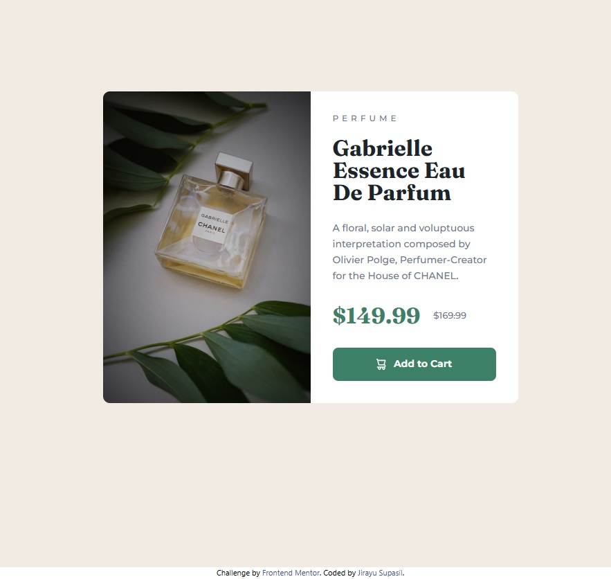

# Frontend Mentor - Product preview card component solution

This is a solution to the [Product preview card component challenge on Frontend Mentor](https://www.frontendmentor.io/challenges/product-preview-card-component-GO7UmttRfa). Frontend Mentor challenges help you improve your coding skills by building realistic projects.

## Table of contents

- [Overview](#overview)
  - [Screenshot](#screenshot)
  - [Links](#links)
- [My process](#my-process)
  - [Built with](#built-with)
  - [What I learned](#what-i-learned)
  - [Continued development](#continued-development)
  - [Useful resources](#useful-resources)
- [Author](#author)
- [Acknowledgments](#acknowledgments)

## Overview

### Screenshot

### Links

- Solution URL: [GitHub](https://github.com/jsupasil/frontend-mentor-newbie-recipe-page)
- Live Site URL: [Vercel](https://frontend-mentor-newbie-recipe-page.vercel.app/)

## My process

### What I learned

### Built with

- Semantic HTML5 markup
- Responsive Design
- [Tailwind CSS](https://tailwindcss.com/) - Tailwind CSS framework

### What I learned

I learned how to use Tailwind frameword for responsive design and how to make variable for the framework to increase coding effiecient.

### Continued development

There is nothing need to improve yet.

### Useful resources

- [Configuration - Tailwind Css](https://tailwindcss.com/docs/configuration) - This help me list custom variables which are often used but are not in tailwind framework.

## Author

- Website - [Jirayu Supasil](https://github.com/jsupasil)
- Frontend Mentor - [@jsupasil](https://www.frontendmentor.io/profile/jsupasil)

## Acknowledgments

I acknowledge [Tech Up Software Bootscamp](https://www.techupth.com/) for training and supporting which are vastly helpful to complete this project.
